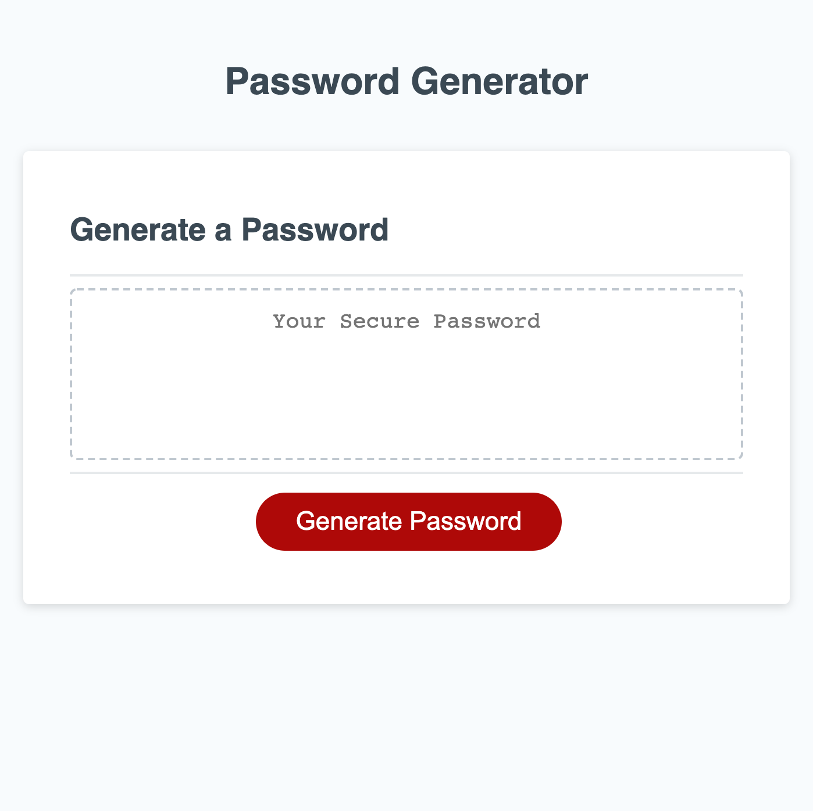

# Password Generator Application

## Description

An application that enables employees to generate random passwords based on criteria that they’ve selected.This app runs in the browser and features dynamically updated HTML and CSS powered by JavaScript code. It has a clean and polished, responsive user interface that adapts to multiple screen sizes. All designed and coded by Luiz Froes.

## Deployed URL

You can view the GitHub pages deployed application [here](https://luizfroes.github.io/password-generate/)

## Technologies Used

- HTML5
- CSS
- JavaScript

## Final Website Screenshot

